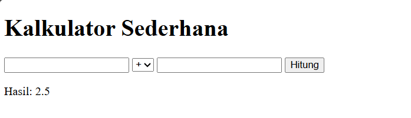
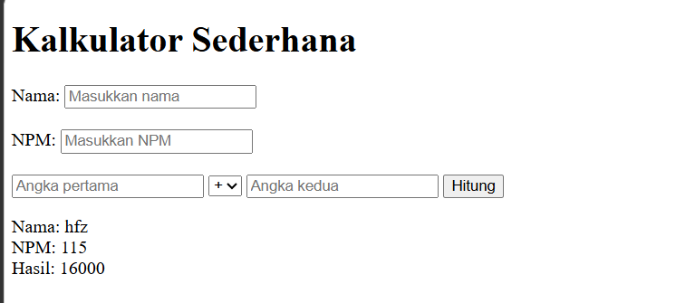
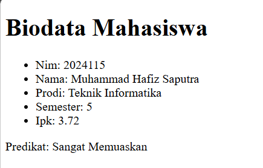
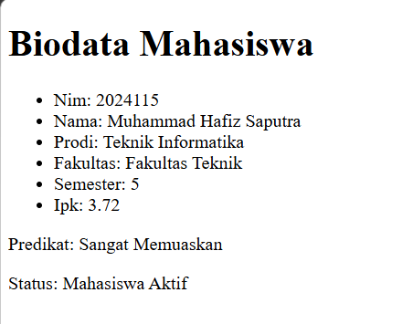

# Tugas 1 Praktikum PBW B

**Nama:** Muhammad Hafiz Saputra  
**NPM:** 4524210115

## 1. Modifikasi Program Kalkulator

### Modifikasi 1

Menambahkan input nama pengguna dan NPM pada form kalkulator, kemudian menampilkan nama dan NPM pada hasil perhitungan.

### Modifikasi 2

Menambahkan validasi nama dan NPM untuk memastikan kedua data tersebut wajib diisi sebelum melakukan perhitungan.

### Penjelasan 5 Bagian Kode Penting

1. **$_SERVER['REQUEST_METHOD']**

   Digunakan untuk mengecek apakah form dikirim menggunakan metode POST.

   ```php
   if ($_SERVER['REQUEST_METHOD'] === 'POST') {
   ```

2. **$_POST**

   Digunakan untuk mengambil data nama, NPM, angka, dan operator dari form.

   ```php
   $nama = $_POST['nama'] ?? '';
   $npm = $_POST['npm'] ?? '';
   $a = $_POST['a'] ?? '';
   $b = $_POST['b'] ?? '';
   $operator = $_POST['operator'] ?? '';
   ```

3. **switch**

   Digunakan untuk menentukan operasi matematika berdasarkan operator yang dipilih.

   ```php
   switch ($operator) {
       case '+':
           $hasil = $a + $b;
           break;

       case '-':
           $hasil = $a - $b;
           break;

       case '*':
           $hasil = $a * $b;
           break;

       case '/':
           if ($b == 0) {
               $pesan = 'Pembagian dengan nol tidak diperbolehkan.';
           } else {
               $hasil = $a / $b;
           }
           break;
   }
   ```

4. **Validasi pembagian dengan nol**

   Digunakan untuk mencegah terjadinya pembagian dengan angka nol.

   ```php
   if ($b == 0) {
       $pesan = 'Pembagian dengan nol tidak diperbolehkan.';
   }
   ```

5. **Validasi nama dan NPM**

   Digunakan untuk memastikan nama dan NPM telah diisi sebelum proses perhitungan dilakukan.

   ```php
   if ($nama === '' || $npm === '') {
       $pesan = 'Nama dan NPM wajib diisi.';
   }
   ```

### Screenshot Sebelum Modifikasi



### Screenshot Sesudah Modifikasi




## 2. Modifikasi Program Biodata

### Modifikasi 1

Menambahkan field fakultas pada data mahasiswa.

### Modifikasi 2

Menambahkan status mahasiswa berdasarkan semester menggunakan function `statusSemester()`.

### Penjelasan 5 Bagian Kode Penting

1. **Function statusKelulusan()**

   Digunakan untuk menentukan predikat mahasiswa berdasarkan nilai IPK.

   ```php
   function statusKelulusan(float $ipk): string
   {
       if ($ipk >= 3.50) return 'Sangat Memuaskan';
       if ($ipk >= 3.00) return 'Memuaskan';
       return 'Perlu Peningkatan';
   }
   ```

2. **Function statusSemester()**

   Digunakan untuk menentukan status mahasiswa berdasarkan semester.

   ```php
   function statusSemester(int $semester): string
   {
       if ($semester <= 7) return 'Mahasiswa Aktif';
       return 'Semester Akhir';
   }
   ```

3. **Array $mahasiswa**

   Digunakan untuk menyimpan data biodata mahasiswa seperti NIM, nama, prodi, fakultas, semester, dan IPK.

   ```php
   $mahasiswa = [
       'nim' => '2024115',
       'nama' => 'Muhammad Hafiz Saputra',
       'prodi' => 'Teknik Informatika',
       'fakultas' => 'Fakultas Teknik',
       'semester' => 5,
       'ipk' => 3.72
   ];
   ```

4. **foreach**

   Digunakan untuk menampilkan data mahasiswa satu per satu dari array.

   ```php
   foreach ($mahasiswa as $kunci => $nilai):
   ```

5. **htmlspecialchars()**

   Digunakan untuk menampilkan data dengan aman pada halaman HTML.

   ```php
   htmlspecialchars((string)$nilai)
   ```

### Screenshot Sebelum Modifikasi



### Screenshot Sesudah Modifikasi




## 3. Error yang Pernah Muncul

### Error

`The requested resource /contoh1.php was not found on this server.`

### Penyebab

File `contoh1.php` berada di dalam folder `pertemuan1`, sehingga URL yang digunakan tidak sesuai dengan lokasi file.

### Langkah Perbaikan

Saya mengecek kembali lokasi file pada folder `pertemuan1`. Setelah itu, URL diperbaiki dengan menambahkan folder `pertemuan1`, sehingga file dapat diakses melalui:

`http://localhost:8000/pertemuan1/contoh1.php`