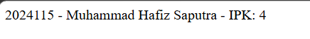
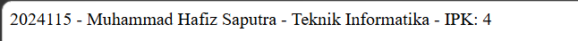
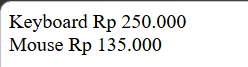
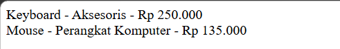

# Tugas 2 Praktikum PBW

**Nama:** Muhammad Hafiz Saputra  
**NPM:** 4524210115

## 1. Modifikasi Program Produk dan Produk Diskon

### Modifikasi 1
Menambahkan field `kategori` pada class `Produk` dan `ProdukDiskon` untuk memberikan informasi mengenai jenis produk.

### Modifikasi 2
Menambahkan validasi harga dan diskon untuk memastikan harga tidak bernilai negatif dan diskon berada pada rentang 0 sampai 100 persen.

### Penjelasan 5 Bagian Kode Penting

1. **Interface BisaDihitung**  
   Digunakan untuk menentukan method `hargaAkhir()` yang harus dimiliki oleh class yang mengimplementasikan interface.

   `interface BisaDihitung { public function hargaAkhir(): float; }`

2. **Class Produk**  
   Digunakan untuk menyimpan data produk berupa nama, harga, dan kategori.

   `class Produk implements BisaDihitung { public function __construct( protected string $nama, protected float $harga, protected string $kategori ) {} }`

3. **Validasi Harga**  
   Digunakan untuk memastikan harga produk tidak boleh memiliki nilai negatif.

   `if ($harga < 0) { throw new InvalidArgumentException('Harga tidak boleh negatif.'); }`

4. **Class ProdukDiskon**  
   Digunakan sebagai turunan dari class `Produk` dan memiliki tambahan atribut diskon.

   `class ProdukDiskon extends Produk { public function __construct( string $nama, float $harga, string $kategori, private float $diskon ) { parent::__construct($nama, $harga, $kategori); } }`

5. **Method hargaAkhir()**  
   Digunakan untuk menghitung harga akhir produk setelah mendapatkan diskon.

   `public function hargaAkhir(): float { return $this->harga * (1 - $this->diskon / 100); }`

### Screenshot Sebelum Modifikasi

### Screenshot Sesudah Modifikasi

## 2. Modifikasi Program Mahasiswa

### Modifikasi 1
Menambahkan field `prodi` pada class `Mahasiswa` untuk menyimpan program studi mahasiswa.

### Modifikasi 2
Menambahkan validasi NIM untuk memastikan NIM tidak boleh kosong sebelum data mahasiswa dibuat.

### Penjelasan 5 Bagian Kode Penting

1. **Interface Identitas**  
   Digunakan untuk menentukan method `ringkasan()` yang harus dimiliki oleh class yang mengimplementasikan interface.

   `interface Identitas { public function ringkasan(): string; }`

2. **Class Mahasiswa**  
   Digunakan untuk menyimpan data mahasiswa berupa NIM, nama, prodi, dan IPK.

   `class Mahasiswa implements Identitas { private string $nim; private string $nama; private string $prodi; protected float $ipk; }`

3. **Validasi NIM**  
   Digunakan untuk memastikan NIM tidak boleh kosong.

   `if ($nim === '') { throw new InvalidArgumentException('NIM tidak boleh kosong.'); }`

4. **Method setIpk()**  
   Digunakan untuk mengatur nilai IPK sekaligus memastikan nilai IPK berada pada rentang 0 sampai 4.

   `public function setIpk(float $ipk): void { if ($ipk < 0 || $ipk > 4) { throw new InvalidArgumentException('IPK harus 0 sampai 4.'); } $this->ipk = $ipk; }`

5. **Method ringkasan()**  
   Digunakan untuk menampilkan ringkasan data mahasiswa berupa NIM, nama, prodi, dan IPK.

   `public function ringkasan(): string { return $this->nim . ' - ' . $this->nama . ' - ' . $this->prodi . ' - IPK: ' . $this->ipk; }`

### Screenshot Sebelum Modifikasi

### Screenshot Sesudah Modifikasi

## 3. Error yang Pernah Muncul

### Error

`InvalidArgumentException: IPK harus 0 sampai 4.`

### Penyebab

Error terjadi ketika nilai IPK yang dimasukkan berada di luar rentang 0 sampai 4. Pada program, nilai IPK harus sesuai dengan rentang tersebut karena IPK memiliki nilai maksimal 4.

### Langkah Perbaikan

Saya mengecek kembali nilai IPK yang dimasukkan pada object `Mahasiswa`. Nilai IPK kemudian diperbaiki agar berada pada rentang 0 sampai 4.

Contoh nilai yang benar:

`$mhs = new Mahasiswa('2024115', 'Muhammad Hafiz Saputra', 'Teknik Informatika', 4.00);`

Dengan nilai tersebut, program dapat dijalankan karena IPK berada pada rentang yang diperbolehkan.