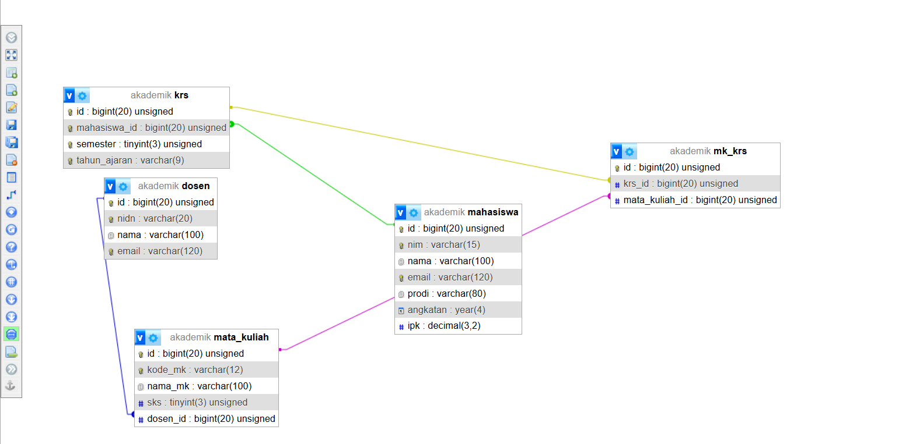
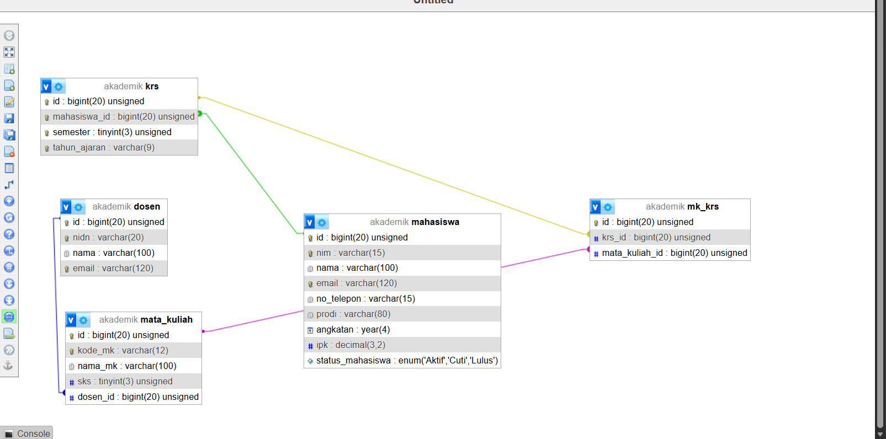

# Tugas 3 Praktikum PBW

**Nama:** Muhammad Hafiz Saputra

**NPM:** 4524210115

## Modifikasi Database Akademik

### Modifikasi 1

Menambahkan kolom `no_telepon` pada tabel `mahasiswa` untuk menyimpan nomor telepon mahasiswa.

### Modifikasi 2

Menambahkan kolom `status_mahasiswa` pada tabel `mahasiswa` untuk menyimpan status mahasiswa seperti Aktif, Cuti, dan Lulus.

### Penjelasan 5 Bagian Kode Penting

1. **Membuat Database**

   Digunakan untuk membuat database `akademik` jika database tersebut belum tersedia.

   ```php
   $sqlCreateDB = "CREATE DATABASE IF NOT EXISTS akademik";

   if (mysqli_query($koneksi, $sqlCreateDB)) {
       echo "Database berhasil dibuat atau sudah ada.<br>";
   } else {
       echo "Error membuat database: " . mysqli_error($koneksi) . "<br>";
   }
   ```

2. **Membuat Tabel Mahasiswa**

   Digunakan untuk membuat tabel `mahasiswa` yang menyimpan data NIM, nama, email, prodi, angkatan, dan IPK.

   ```php
   $sqlMahasiswa = "CREATE TABLE IF NOT EXISTS mahasiswa (
       id BIGINT UNSIGNED AUTO_INCREMENT PRIMARY KEY,
       nim VARCHAR(15) NOT NULL UNIQUE,
       nama VARCHAR(100) NOT NULL,
       email VARCHAR(120) NOT NULL UNIQUE,
       prodi VARCHAR(80) NOT NULL,
       angkatan YEAR NOT NULL,
       ipk DECIMAL(3,2) DEFAULT 0.00
   ) ENGINE=InnoDB";
   ```

3. **Menambahkan Kolom no_telepon**

   Digunakan untuk menambahkan kolom `no_telepon` pada tabel `mahasiswa`. Program terlebih dahulu mengecek apakah kolom tersebut sudah tersedia.

   ```php
   $cekNoTelepon = mysqli_query(
       $koneksi,
       "SHOW COLUMNS FROM mahasiswa LIKE 'no_telepon'"
   );

   if (mysqli_num_rows($cekNoTelepon) == 0) {

       $sqlTambahTelepon = "
           ALTER TABLE mahasiswa
           ADD COLUMN no_telepon VARCHAR(15) NOT NULL
           AFTER email
       ";

       if (mysqli_query($koneksi, $sqlTambahTelepon)) {
           echo "Kolom no_telepon berhasil ditambahkan.<br>";
       }
   }
   ```

4. **Menambahkan Status Mahasiswa**

   Digunakan untuk menambahkan kolom `status_mahasiswa` dengan pilihan status Aktif, Cuti, atau Lulus.

   ```php
   $cekStatus = mysqli_query(
       $koneksi,
       "SHOW COLUMNS FROM mahasiswa LIKE 'status_mahasiswa'"
   );

   if (mysqli_num_rows($cekStatus) == 0) {

       $sqlTambahStatus = "
           ALTER TABLE mahasiswa
           ADD COLUMN status_mahasiswa
           ENUM('Aktif', 'Cuti', 'Lulus')
           DEFAULT 'Aktif'
           AFTER ipk
       ";

       if (mysqli_query($koneksi, $sqlTambahStatus)) {
           echo "Kolom status_mahasiswa berhasil ditambahkan.<br>";
       }
   }
   ```

5. **Membuat Relasi Foreign Key**

   Digunakan untuk menghubungkan tabel `mata_kuliah` dengan tabel `dosen` melalui kolom `dosen_id`.

   ```php
   CONSTRAINT fk_matakuliah_dosen_id
       FOREIGN KEY (dosen_id)
       REFERENCES dosen(id)
       ON UPDATE CASCADE
       ON DELETE SET NULL
   ```

   Relasi tersebut membuat `dosen_id` pada tabel `mata_kuliah` mengacu pada `id` pada tabel `dosen`.

### Screenshot Sebelum Modifikasi



### Screenshot Sesudah Modifikasi



## Error yang Pernah Muncul

### Error

```text
#1064 - You have an error in your SQL syntax
```

### Penyebab

Error terjadi karena menggunakan perintah:

```sql
DROP DATABASES;
```

Sintaks tersebut tidak sesuai karena `DROP DATABASE` membutuhkan nama database yang ingin dihapus.

### Langkah Perbaikan

Perintah diperbaiki menjadi:

```sql
DROP DATABASE IF EXISTS akademik;
```

Setelah database `akademik` dihapus, program PHP dijalankan kembali sehingga database dan tabel dapat dibuat ulang sesuai dengan struktur yang telah dimodifikasi.