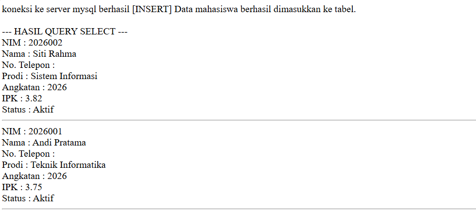
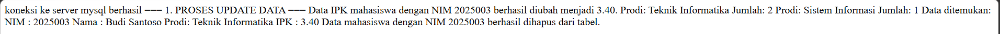
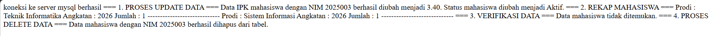

# Tugas 4 Praktikum PBW

**Nama:** Muhammad Hafiz Saputra

**NPM:** 4524210115

## 1. Modifikasi Program INSERT dan SELECT Mahasiswa

### Modifikasi 1

Menambahkan field `no_telepon` dan `status_mahasiswa` pada proses INSERT untuk menyimpan informasi tambahan mahasiswa.

### Modifikasi 2

Menambahkan filter berdasarkan `angkatan` pada proses SELECT dan menampilkan data `angkatan`, `no_telepon`, serta `status_mahasiswa`.

### Penjelasan 5 Bagian Kode Penting

1. **Koneksi dan Pemilihan Database**

   Digunakan untuk menghubungkan program dengan database dan memilih database `akademik`.

   `require_once 'koneksi.php';`

   `mysqli_select_db($koneksi, 'akademik');`

2. **Proses INSERT dengan mysqli_query()**

   Digunakan untuk menjalankan perintah INSERT dan memasukkan data mahasiswa ke dalam database.

   `if (mysqli_query($koneksi, $sqlInsert)) {`

   `echo "[INSERT] Data mahasiswa berhasil dimasukkan ke tabel. ";`

   `}`

3. **Proses SELECT dengan mysqli_query()**

   Digunakan untuk menjalankan query SELECT dan menyimpan hasilnya ke dalam variabel `$result`.

   `$result = mysqli_query($koneksi, $sqlSelect);`

4. **Perulangan while dan mysqli_fetch_assoc()**

   Digunakan untuk mengambil dan menampilkan data mahasiswa satu per satu dari hasil query.

   `while ($row = mysqli_fetch_assoc($result)) {`

   `echo "NIM : " . $row['nim'] . " ";`

   `echo "Nama : " . $row['nama'] . " ";`

   `}`

5. **Pengecekan Jumlah Data**

   Digunakan untuk mengecek apakah query menghasilkan data mahasiswa atau tidak.

   `if (mysqli_num_rows($result) > 0) {`

   `// menampilkan data mahasiswa`

   `} else {`

   `echo "Tidak ada data mahasiswa dengan kriteria tersebut. ";`

   `}`

### Screenshot Sebelum Modifikasi

### Screenshot Sesudah Modifikasi

## 2. Modifikasi Program UPDATE, GROUP BY, SELECT, dan DELETE

### Modifikasi 1

Menambahkan perubahan `status_mahasiswa` pada proses UPDATE sehingga proses UPDATE tidak hanya mengubah IPK, tetapi juga status mahasiswa.

### Modifikasi 2

Menambahkan `angkatan` pada proses GROUP BY untuk membuat rekap jumlah mahasiswa berdasarkan program studi dan angkatan.

### Modifikasi 3

Menambahkan informasi `no_telepon`, `angkatan`, dan `status_mahasiswa` pada proses SELECT untuk verifikasi data sebelum dilakukan penghapusan.

### Penjelasan 5 Bagian Kode Penting

1. **Proses UPDATE dengan mysqli_query()**

   Digunakan untuk menjalankan proses perubahan data IPK dan status mahasiswa.

   `$sqlUpdate = "UPDATE mahasiswa SET ipk = 3.40, status_mahasiswa = 'Aktif' WHERE nim = '2025003'";`

   `if (mysqli_query($koneksi, $sqlUpdate)) {`

   `echo "Data IPK mahasiswa dengan NIM 2025003 berhasil diubah menjadi 3.40.\n";`

   `}`

2. **Perulangan while pada Rekap Data**

   Digunakan untuk mengambil setiap hasil rekap mahasiswa dan menampilkannya satu per satu.

   `while ($row = mysqli_fetch_assoc($resultRekap)) {`

   `echo "Prodi : " . $row['prodi'] . "\n";`

   `echo "Angkatan : " . $row['angkatan'] . "\n";`

   `echo "Jumlah : " . $row['jumlah_mahasiswa'] . "\n";`

   `}`

3. **Pengecekan Data Sebelum Delete**

   Digunakan untuk mengecek apakah data mahasiswa dengan NIM tertentu tersedia sebelum dilakukan penghapusan.

   `if (mysqli_num_rows($resultVerifikasi) > 0) {`

   `$row = mysqli_fetch_assoc($resultVerifikasi);`

   `echo "Data ditemukan:\n";`

   `}`

4. **Menampilkan Data Mahasiswa**

   Digunakan untuk menampilkan informasi mahasiswa yang ditemukan sebelum proses DELETE dilakukan.

   `echo "NIM : " . $row['nim'] . "\n";`

   `echo "Nama : " . $row['nama'] . "\n";`

   `echo "No. Telepon : " . $row['no_telepon'] . "\n";`

   `echo "Prodi : " . $row['prodi'] . "\n";`

   `echo "Angkatan : " . $row['angkatan'] . "\n";`

   `echo "IPK : " . $row['ipk'] . "\n";`

   `echo "Status : " . $row['status_mahasiswa'] . "\n";`

5. **Proses DELETE dengan mysqli_query()**

   Digunakan untuk menjalankan proses penghapusan data mahasiswa berdasarkan NIM.

   `$sqlDelete = "DELETE FROM mahasiswa WHERE nim = '2025003'";`

   `if (mysqli_query($koneksi, $sqlDelete)) {`

   `echo "Data mahasiswa dengan NIM 2025003 berhasil dihapus dari tabel.\n";`

   `}`

### Screenshot Sebelum Modifikasi

### Screenshot Sesudah Modifikasi

## 3. Error yang Pernah Muncul

### Error

`Unknown column 'no_telepon' in 'field list'`

### Penyebab

Error terjadi ketika program mencoba menggunakan kolom `no_telepon` pada query INSERT atau SELECT, tetapi kolom tersebut belum tersedia pada tabel `mahasiswa`.

### Langkah Perbaikan

Saya mengecek kembali struktur tabel `mahasiswa` pada database `akademik`. Kolom `no_telepon` dan `status_mahasiswa` kemudian ditambahkan pada tabel sesuai dengan modifikasi pada tugas sebelumnya.

Setelah struktur tabel diperbaiki, program dapat dijalankan kembali dan query INSERT, SELECT, UPDATE, GROUP BY, serta DELETE dapat diproses.